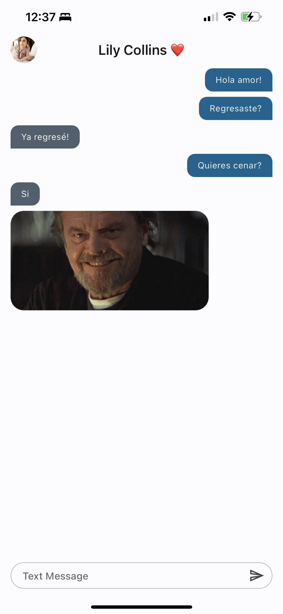

# Yes/No App with Lily Collins

#### Overview
This repository contains a Flutter application designed to simulate chatting with Lily Collins, focused primarily on Yes/No questions. The app provides an engaging and user-friendly interface for users to interact with a virtual Lily Collins, offering a unique experience of conversational dynamics.

#### Features
- **Chat Interface**: A clean and intuitive chat interface for interacting with the virtual Lily Collins.
- **Yes/No Question Handling**: Specialized in processing and responding to Yes/No questions.

#### Installation
1. Clone the repository: `git clone [repository URL]`
2. Navigate to the project directory: `cd [project folder]`
3. Install dependencies: `flutter pub get`
4. Run the app: `flutter run`

#### Usage
Simply launch the app, and you will be greeted by the chat interface. Type in your Yes/No questions, and the virtual Lily Collins will respond accordingly.

### Images

#### Disclaimer
This application is purely a fan-made project and is not officially associated with Lily Collins or any of her affiliates.